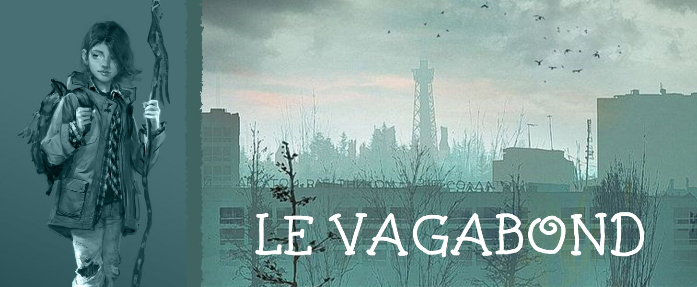

*Classe additionnelle pour le jeu de rôle Exploirateurs de Bruines*

Les vagabonds sont les vers solitaires des terres humides. A peine moins bizarre qu'un bizarre, le vagabond a quand même le cerveau assez cabossé pour vouloir pieuter en dehors des enclaves. Les enclavés c'est dentaire, le vagabond c'est tout le contraire, il voyage de troubillon en troubillon mais ne croupit jamais longtemps au même endroit. A force de dédaler, il en connaît un rayon sur comment survivre dans la ville - ce que le chef a lu dans un livre, le vagabond l'a sûrement vu en vrai, en tout cas c'est ce qu'il raconte.
## Bonus du niveau 1

- **Points de vie :** 4
- **Dans le doute, ça se bidouille :** MD doit accepter qu'un vagabond est débrouillard et qu'il peut rapidement décoincer une porte, dépanner une machine ou bricoler un bidule sur le pouce - même si parfois, faudra quand même avoir les bons outils pour s'aider.
- **Pistache** : Une fois par jour, le vagabond peut flairer un objet trouvé dans le décor pour avoir des indices sur son ancien propriétaire ou la dernière personne à l'avoir toucheté - où est-il allé, à quoi il ressemblait, qu'est-ce qu'il trafiquait…
## Gagner un niveau

- **Points de vie :** le vagabond gagne D6 points de vie en plus.
- **Bonus de résistance :** On lance un D20 pour chaque Résistance - si on fait plus que le score, la Résistance augmente de 1.
- **Nouvelle Ficelle** : A force d'artemper la ville, le vagabond met au poing quelques choses trappes pour l'aider à survivre. Chaque fois qu'il gagne un niveau, le vagabond invente une ficelle en s'aidant de la liste de mots suivante :  *arc, flèches, œil, capuchon, animaux, sirènes, spesctres, sauvage, chasse, camouflage, pistage, piège, outils, nature, herbe, arbre, poison, surprise, esquive, loup, autres idées…*

Exemples de ficelles inventées à partir des mot *herbe* et *chasseur* : 
- **Poteau-feu :** le vagabond peut mijoter des zèbres qu'il trouve pour faire une potion avec un effet anchois : rendre 1PV - donner 1 avantage à un test de Résistance. La potion périme vite donc faut la déguster rapidos.
- **Chasseur déprime :** si le vagabond connaît le nom de sa cible, il lui fait 2 fois plus de dégâts la première fois qu'il l'attaque.
