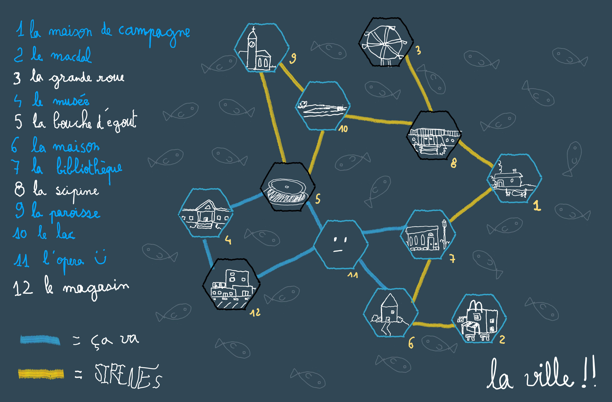
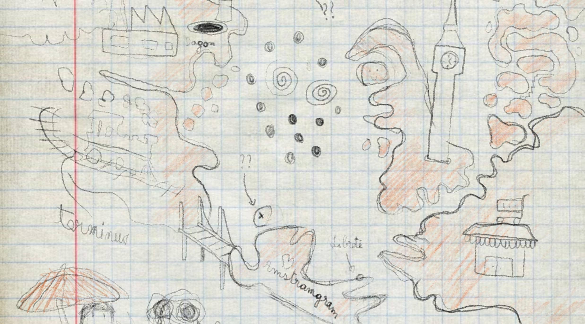

Ces derniers mois, je m'essaye à la campagne jeu de rôle bac à sable. L'année dernière j'ai préparé une campagne Exploirateurs de Bruines proche d'une West Marches - un format de campagne dans lequel le groupe de joueur n'est pas fixe et peut varier d'une partie à l'autre. Chaque partie était l'occasion pour les personnages d'explorer un donjon (une bruine en l'occurrence), affronter des ennemis, découvrir des trésors, avant de rentrer à la base.

*Carte du monde pour Exploirateurs de Bruines*
## Des parties autosuffisantes

Un avantage de ce format de campagne, c'est qu'il me contraint à une préparation très concentrée, pour une partie autosuffisante, ou "self-contained", en anglais. Les joueurs choisissent à l'avance un lieu à explorer, avec un objectif clair en tête. Je n'ai plus qu'à préparer ce lieu, et le jour J, on joue ! C'est simple, efficace, et on est sûrs de jouer à une partie rythmée et riche en rebondissements et en choix cornéliens.

De plus, je suis certain que ma préparation va me servir. Lorsque je prépare des éléments pour une partie de jeu de rôle, je ressens un enthousiasme ou une "hype" de les voir en jeu avec les autres joueurs, que ce soit une ambiance, un grand méchant, une énigme, une musique… J'éprouve un vrai plaisir à préparer un donjon la veille pour le lendemain - ça me laisse juste le temps qu'il faut pour nourrir des attentes avant de découvrir le soir de la partie ce que ma préparation va permettre avec le reste de la table.

Tout n'est pas rose non plus. Le plus gros point faible du format est l'impératif pour les personnages-joueurs de rentrer au village à la fin de la partie. Et lorsque l'objectif de la mission est à portée de main, on est très tentés d'aller jusqu'au bout, quitte à tirer sur la corde, dans la fiction, ou pire, dans la vraie vie, et à prolonger la partie bien au-delà des horaires raisonnables… Ce qui, en tant que meneur, m'impose d'être très vigilant au rythme et aux minutes qui passent, parfois au détriment de mon propre plaisir de jeu.

## Le problème du "vrai" bac à sable

J'ai récemment lancé la saison 2 de ma campagne d'Exploirateurs de Bruines, avec cette fois-ci un groupe fixe composé de joueurs qui avaient envie de prolonger l'aventure. 

Jouer avec un groupe fixe permet des choses différentes. On se passe notamment de l'impératif pour les personnages de rentrer au village à chaque fin de partie, car on sait que les mêmes joueurs seront présents la prochaine fois. Cela me libère aussi de la gestion du rythme, arrêter une partie en plein milieu d'un donjon n'est plus un problème. Et il y a bien d'autres avantages, que je ne vais pas énumérer ici.

*Carte du monde pour ma saison 2 d'Exploirateurs de Bruines*

Un inconvénient que je découvre avec la pratique concerne justement ma préparation. Partie après partie, je me rends compte que bien souvent, celle-ci est en décalage avec la progression des personnages-joueurs. Parce que je tiens à laisser les joueurs très (trop ?) libres, ils ont tendance à s'éparpiller, avancer, faire demi-tour, réfléchir à un plan, discuter longuement avec un PNJ pour se renseigner… Beaucoup de moments de jeu amusants, mais qui retardent l'arrivée en jeu des éléments que j'ai préparés.

Ainsi, je me retrouve souvent dans la situation d'avoir beaucoup d'éléments préparés en avance, que les joueurs ne rencontreront que d'ici plusieurs parties. Ce n'est probablement pas un problème en soi, mais pour moi c'en est un. Comme nous ne jouons qu'une fois toutes les deux semaines, cela me laisse bien assez de temps pour que mon enthousiasme redescende. Quand les personnages-joueurs rencontrent finalement le gros donjon ou le grand méchant que j'avais préparé, je ne suis plus aussi motivé pour le jouer, car j'ai eu depuis plein de nouvelles idées, bien plus excitantes… 

## "I want my fun NOW... TONIGHT!"

Traduction : *"Je veux m'amuser MAINTENANT… CE SOIR !"*. Ce slogan est issu des conseils pour MJ du jeu de rôle ICRPG de Runehammer. Dans ICRPG, l'auteur avertit justement de ce problème des grandes et foisonnantes campagnes bac à sable. Je cite : *"[elles] reportent l'émerveillement et l'excitation à plus tard".*

La solution ? Ne préparer qu'une partie à la fois. Garder l'agentivité des joueurs, mais penser les parties davantage comme des one shots - en introduisant des éléments de jeu auxquels les joueurs devront réagir **ce soir**, plutôt que d'espérer et d'attendre qu'ils les atteignent… 

Le but n'est pas de prévoir un déroulement de scènes, car j'aime le bac à sable aussi parce qu'on joue pour découvrir ce qui va se passer. L'idée est de déplacer le curseur de la préparation. Au lieu de préparer un monde pour des personnages, je prépare une partie, pour des joueurs - le fun de la partie avant la cohérence de l'univers.

Je pense que cela correspond mieux à ma manière d'aborder une partie de jeu de rôle. Mais j'écris ces lignes avant d'avoir pu tester cette nouvelle manière de faire, donc, à suivre :)