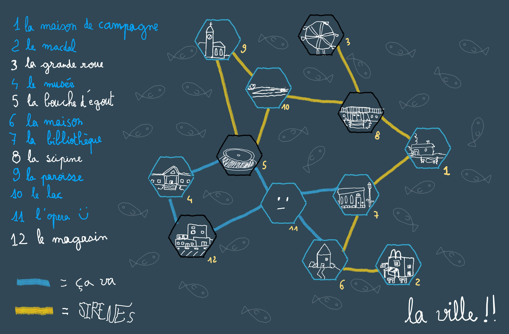

Ces derniers mois, je m'essaye à la campagne bac à sable. L'année dernière j'ai préparé une campagne Exploirateurs de Bruines, dans un format proche de la westmarch. Chaque partie était l'occasion pour les personnages d'explorer un donjon, affronter des ennemis, découvrir des trésors, avant de rentrer à la base.

Un avantage de ce format de campagne, c'est qu'il me   à une préparation très concentrée, pour une partie autosuffisante, ou "self-contained", en anglais. Les joueurs choisissent à l'avance un lieu à explorer, je prépare ce lieu, et le jour J, on joue ! C'est simple et efficace. 