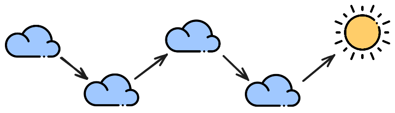
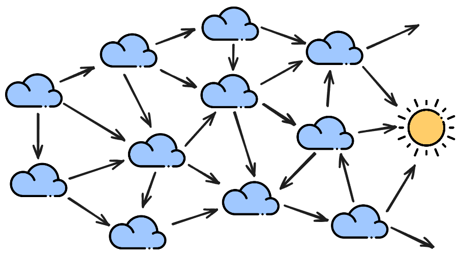
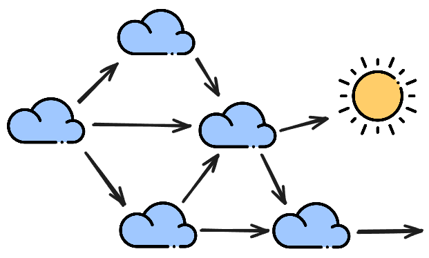
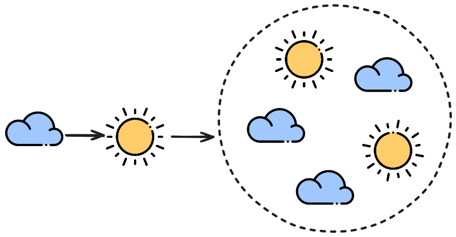

Dans un précédent article, j'évoquais ma campagne d'Exploirateurs de bruines et les réflexions qui me traversent en tant que Maître Déluge : *[Le problème du bac à sable](https://dragonodile.netlify.app/posts/le-probleme-du-bac-a-sable/)*. 

Lorsque je prépare une partie de jeu de rôle, en particulier des campagnes d'aventures, j'ai souvent une super idée que j'ai vraiment envie de voir en jeu avec le reste de la table. Il peut s'agir d'un nouveau PNJ, un nouveau lieu, une scène, un rebondissement scénaristique… Le risque, c'est de créer un scénario couloir, pour guider les joueurs vers cet élément coûte que coûte, au détriment de leur liberté d'action.

Je schématiserais une telle partie ainsi : 

*Ici et dans la suite de l'article, **le soleil** représente l'élément excitant que j'ai préparé, ma "super idée" que j'ai envie d'introduire dans la partie. **Les nuages** sont des péripéties que les joueurs doivent surmonter.*

Dans l'exemple ci-dessus, les joueurs ont peu de liberté, il n'y a qu'un seul chemin qui mène jusqu'au soleil.

Pour contourner ce problème, il y a plusieurs solutions. L'une d'entre elle est de préparer non pas une partie spécifique, mais un grand bac à sable : 

Ici, les joueurs ont énormément de liberté, au point qu'ils peuvent contourner le soleil s'ils le souhaitent. De plus, il y a beaucoup de nuages sur leur chemin et il est tout à fait possible qu'ils n'aient même pas le temps d'atteindre le soleil d'ici la fin de la partie. Cette méthode a des avantages mais aussi des inconvénients dont je parlais dans mon précédent article. 

C'est pourquoi dernièrement j'ai utilisé une autre méthode de préparation, focalisée sur une partie unique et que je schématiserais ainsi : 

Ici, les joueurs ont toujours beaucoup de liberté, mais la préparation est plus restreinte. Puisqu'il y a peu de nuages, les joueurs ont plus de chances de découvrir le soleil au cours de la partie. Je laisse quand même un chemin alternatif, au cas où les joueurs n'aient vraiment pas envie d'explorer dans la direction du soleil. 

Cette méthode de préparation a donné d'excellentes parties, riches en péripéties et en rebondissements au point que je pensais avoir trouvé la formule magique pour des campagnes d'aventure.

Mais une partie récente m'a confronté à un problème. Les joueurs ont passé beaucoup plus de temps que je ne le pensais sur le premier nuage - ce qui n'est pas négatif en soi, mais j'étais bien embêté, car les minutes passaient et j'allais devoir accélérer les choses. Au cours de cette partie, on a tous bien senti que je pressais les joueurs plus que d'habitude. J'ai aussi dû sacrifier à contre cœur quelques nuages pour que les joueurs aient le temps d'arriver jusqu'au soleil que j'avais préparé. Et ça valait le coup ! La scène finale était intense et forte en émotions, tout le monde a adoré. Mais cette partie m'a laissé insatisfait - même si j'étais content d'avoir joué le soleil avec les autres joueurs, j'ai eu la sensation de restreindre leurs possibilités d'action par la pression exercée et de trahir des éléments de ma préparation. 

L'objectif est donc d'introduire le soleil, tout en laissant beaucoup de liberté aux joueurs. C'est pourquoi j'ai préparé ma dernière partie ainsi : 

Avec cette méthode, j'assume mes envies de MJ. J'introduis le soleil dès la première heure de jeu, au tout début ou éventuellement derrière un nuage. Cette méthode me permet de lâcher prise. Le premier acte de la partie est certes orienté, mais une fois le soleil atteint, j'ai obtenu ma satisfaction en tant que meneur, j'ai pu montrer aux joueurs ce petit bout d'univers que j'avais préparé. La suite est maintenant un vrai bac à sable, sans pression, il ne reste plus qu'à profiter entièrement des choix des joueurs. Comme l'indique le schéma, il est tout à fait possible de préparer d'autres soleils - mais ils sont quand à eux complètement optionnels et davantage spatialisés, si les joueurs ne s'y intéressent pas, ce n'est pas un problème. 

La partie préparée avec cette méthode a été excellente, une des meilleures de la campagne d'après toute la table. 

Les joueurs ont commencé la partie dans un moment de calme et avaient déjà choisi leur prochaine destination. Ils ont eu du temps pour échanger, entre eux et avec des PNJ dans des dialogues passionnants. Après une heure de jeu, j'ai introduit le soleil que j'avais préparé : au cours de leur voyage, les personnages ont rencontré une créature légendaire, dont ils avaient entendu parler. Cette rencontre était inévitable. Bien sûr, le choix de la réaction à adopter restaient entièrement le leur. Allaient-ils attaquer ? négocier ? observer ? 

Le groupe a choisi de fuir, la scène a été marquante mais rapide. A partir de là, le reste de la partie a été l'occasion de découvrir quelles nouvelles intrigues allaient émerger du bac à sable qu'il restait à explorer. J'ai quand même gardé un œil sur le temps qui passe, et j'ai continué à introduire de nouvelles complications pour maintenir un rythme dynamique. Mais les joueurs ont senti qu'ils étaient libérés de la contrainte du temps, tout comme j'étais libéré de la pression de vouloir leur faire découvrir le soleil à tout prix. Les scènes de ce dernier acte étaient inattendues et mémorables, et ont plu a toute la table.

Cette méthode est pour moi le meilleur des deux mondes. Quand je joue en pur bac à sable, certaines parties peuvent être un peu fades. Placer le soleil au début garantit au minimum une scène marquante, importante, et laisse toute la deuxième moitié de la partie entièrement ouverte pour se laisser surprendre. 

Evidemment, je ne pense pas que cette méthode soit parfaite, ça serait trop facile et trop ennuyeux, mais j'ai de bons espoirs et je tenais à partager mes réflexions sur ce sujet !

--

*Icônes utilisées :*
<a href="https://www.flaticon.com/fr/icones-gratuites/ciel" title="ciel icônes">Ciel icônes créées par Freepik - Flaticon</a>,
<a href="https://www.flaticon.com/fr/icones-gratuites/soleil" title="soleil icônes">Soleil icônes créées par Freepik - Flaticon</a>