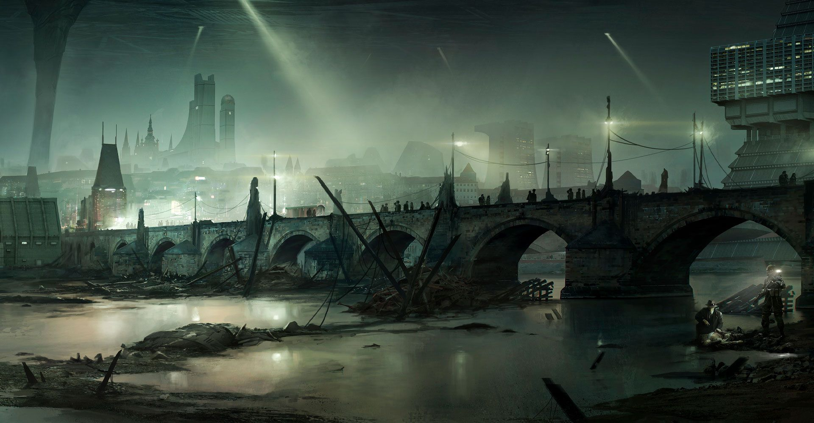
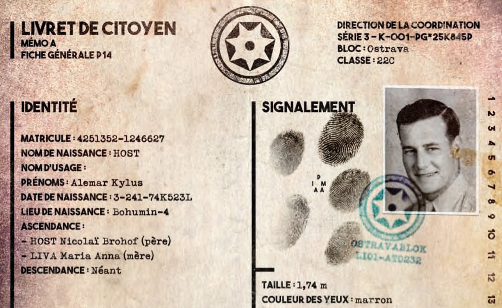

J'ai récemment terminé une courte campagne de NOC avec mon groupe de jeu de rôle. NOC est un jeu avec une structure classique, un meneur et des joueurs, qui se présente ainsi : *"un jeu de rôle situé dans un univers dystopique sombre et rétrofuturiste où l’humanité fait face à l’horreur de l’enfermement au sein d’une structure titanesque aux motivations obscures."* Je précise que j'étais joueur lors de cette campagne et que **je n'ai pas lu la base du jeu**, si ce n'est la partie qui concerne la création de personnages. **Mon retour portera sur la campagne que nous avons jouée avec mon groupe uniquement.** 

### Dystopies et suspension d'incrédulité
J'ai du mal à m'immerger dans les univers dystopiques - j'ai simplement du mal à croire à un monde peuplé d'humains, tous soumis à une unique force politique, absolument tentaculaire qui parvient à maintenir son pouvoir à tous les niveaux de la société. J'adhère bien plus facilement aux univers plus protéiformes, avec différentes communautés, structures, parfois fortes, parfois faibles mais qui existent les unes à côté des autres dans une sorte de chaos, voire de rapport de force. 

Je peux quand même apprécier des fictions dystopiques, notamment dans des films ou des romans, mais le média jeu de rôle apporte une difficulté supplémentaire. Je vois les dystopies comme des univers sombres, implacables et qui écrasent la moindre tentative de subversion. Or, c'est justement ce qu'on incarne dans NOC, une escouade de personnages qui va fouiner là où l'administration l'interdit. 

Pour mener à bien leur missions, nos personnages doivent pourtant se libérer, au moins un peu, du "diktat" - prendre les armes, organiser des révoltes, infiltrer les réseaux de l'administration. Dans notre campagne, nos actions, d'abord en sous-main, ont fini par éclater au grand jour dans des affrontements spectaculaires dignes de grands films d'action. Et il y a un certain plaisir à ça, on veut avoir un effet sur le monde avec nos personnages. Pourtant quand ces scènes arrivent, elles laissent un arrière-goût d'absurdité, et brisent un peu l'immersion. Est-ce normal d'avoir pu accomplir autant de choses dans un univers qui laisse normalement si peu de liberté ?
### Jeu de rôle ou escape-game ?

Je craignais que la campagne fasse la part belle à l'enquête, et ce fut malheureusement le cas. 

NOC est un jeu à l'univers très dense et qui nécessite un gros investissement. Quand je joue à un univers contemporain, post-apocalyptique, médiéval-fantasy, tout est plus simple, j'ai les codes de ces univers, il ne me reste plus qu'à avancer pour découvrir les spécificités de la campagne, les lieux, les PNJ, les secrets… et à incarner mon personnage par la même occasion. 

Incarner mon personnage, c'est justement ce qui m'a manqué dans cette campagne. L'immersion est rendue très difficile dans un contexte d'enquête, qui plus est dans un univers original. En tant que joueurs, nous étions surchargés d'information à démêler, déchiffrer - des indices parfois matériels et très crédibles, de vrais dossiers de plusieurs pages, des dizaines de lignes remplies de données, de vraies ou de fausses pistes… 

Pour décortiquer tous ces éléments, les parties menaient régulièrement à de longues conversations en "méta" avec nos personnages au second plan, pendant que nous autres joueurs nous faisions collectivement des nœuds au cerveau. Nous avons essayé de jouer ces moments en roleplay, mais l'équation reste difficile, voire frustrante. Jouer une scène de réflexion en roleplay, c'est un peu comme conduire une voiture et écrire un SMS en même temps (en moins dangereux), on fait les 2 choses, mais très mal. L'enquête patine, car on sent qu'on serait bien plus efficace pour partager des informations en passant en discussion méta. Et le roleplay en pâtit, comment incarner son personnage quand on est déjà en train de disséquer des tonnes d'informations en tant que joueur ? 

Se pose aussi la question de la compétence du joueur ou du "player skill". Mon personnage connaît cet univers, il y a grandi, connaît ses rouages, au moins en partie. Mon personnage doit pouvoir se faire une idée claire de la situation à partir des indices trouvés. En tant que joueur, c'est un autre affaire. D'abord parce que je suis nul en énigme, ne comptez pas sur moi pour vous tirer d'affaire lors d'un escape-game. Ensuite, parce que je n'aime pas jouer au jeu de rôle pour ça. Passer de longues minutes à méditer lors d'une partie de jeu de cartes, jeu de société, avec plaisir. Mais en jeu de rôle, je veux agir, plutôt que réfléchir.
### Système Nocturne

Mon dernier point à aborder concernant le jeu est le système de résolution, appelé système Nocturne. J'ai eu beaucoup de mal avec ce système qui cherche à illustrer mécaniquement l'univers oppressant de NOC. 

Notre fiche de personnage est remplie de talents - lorsque mon personnage entreprend une action incertaine, le meneur énonce le talent approprié et le seuil de difficulté à dépasser. Si mon personnage a un score suffisant dans ce talent, l'action est réussie automatiquement sans lancer de dé. Dans le cas contraire, je peux "tenter le destin", et jeter les dés pour essayer de battre le seuil de difficulté malgré tout. 

 Le système cherche à éviter la profusion de lancers de dés, et c'est quelque chose que j'apprécie - mais la façon de faire ne me convient pas. Le jeu comporte presque 30 talents, et notre personnage aura 0 points dans nombre d'entre eux. 

Un exemple vaut mieux qu'une longue explication. Voici un échange typique qu'on pouvait avoir à la table : 

- Joueur A : *"Ok, j'aimerais contourner le garde et m'infiltrer dans le laboratoire par une fenêtre."*
- Joueur B : *"Je vais le suivre."*
- MJ : *"Très bien, c'est possible, mais difficile, il vous faut 2 en déplacement, vous avez combien ?"*
- Joueur A : *"Ah ben j'ai 0."*
- Joueur B : *"J'ai 0 aussi."*
- Reste de la table : *rigole*.

Dans cet exemple très caractéristique, un joueur a une idée, qu'il trouve cool et pertinente dans la situation, et qu'il soumet au reste de la table. Malheureusement, avec le système Nocturne, notre attention est détournée. Au lieu de profiter de l'action du personnage dans la fiction, on se concentre sur le score du personnage, noté sur sa fiche. Comme celui-ci va parfois être de 0, l'accent est malheureusement mis sur l'incompétence du personnage. 

Le système cherche à mécaniser des éléments précis de l'univers via des jauges : blessure, traque, traumatisme, fiel, noirceur, espoir… et j'en oublie. Des jauges, nombreuses, que nous avons eu beaucoup de mal à tenir à jour. Encore une fois, l'intention est bonne : retranscrire par le système des effets fictionnels. Malheureusement, dans nos parties, elles n'ont pas eu l'effet escompté.

Mon personnage disposait par exemple d'un talent de "lumière" qui lui permettait de rayonner, métaphoriquement, comme un phare dans cet univers sombre - c'est en tout cas l'image que je m'en faisais. Mécaniquement, cela se traduisait par une capacité de faire baisser la jauge de noirceur des autres personnages. Une jauge de noirceur restée coincée à 0 la majorité du temps et qui n'a jamais inquiété personne lors de la campagne. En bref, mon talent de "lumière" a été complètement inutile, voire ridicule, car lorsque j'avais l'opportunité de m'en servir, les autres joueurs me répondaient que ça ne leur servait à rien.

En bref, c'est assez frustrant pour moi de rejouer à des systèmes aussi mécanisés après avoir gouté à des jeux plus libres/ freeform comme Macchiato Monsters ou Tokyo Otherscape, dans lesquels les effets des talents notés sur notre fiche de personnage sont laissés à notre propre interprétation.

### Etoiles et souhaits

Cette campagne est la première que je joue avec le système Star & Wishes du début à la fin. C'est un système de retour/ feedback expliqué sur le blog The Gauntlet : http://www.brindlewoodbay.com/blog/stars-and-wishes. 

Je ne vais pas détailler le principe, mais je tenais à dire que ça a été un franc succès à notre table. J'étais pourtant sceptique au départ à l'idée de "mécaniser" les débriefs - une partie de jeu de rôle étant déjà une conversation de plusieurs heures organisée par des règles. 

Les débriefs non encadrés peuvent être très intéressants, mais ils se cristallisent souvent autour d'un seul sujet duquel on tire le fil à l'excès. Un système tel que Stars & Wishes donne l'occasion à chaque participant d'exprimer un retour avec un accent mis sur le positif, trop souvent oublié.

Malgré tout, le système reste limité et ne peut pas réconcilier tous les joueurs. Si un joueur aime les scènes de combat, alors qu'un autre déteste ça, Stars & Wishes permet de s'en rendre compte, mais pas forcément de corriger le problème. Finalement, le plus sûr pour garantir une bonne expérience reste de jouer avec des joueurs qui partagent nos préférences. 

--

Au final, une campagne agréable avec beaucoup de nouveauté, même si j'ai conscience que cet article semble rapporter une expérience plutôt mitigée. Heureusement, en jeu de rôle, on peut quand même beaucoup s'amuser, même lorsqu'une partie ou une campagne ne répond pas à toutes nos attentes :) 