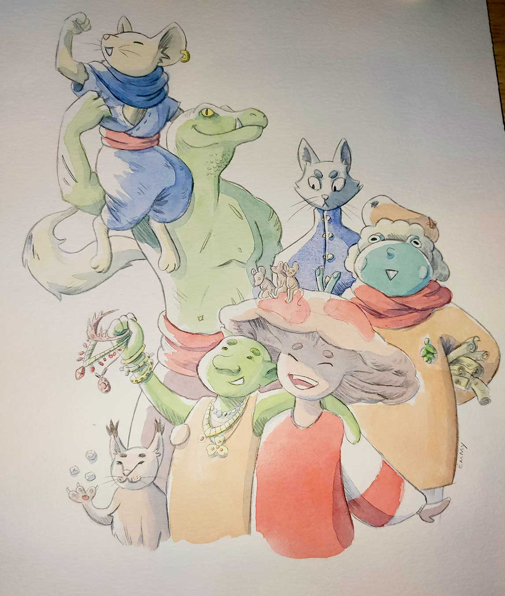
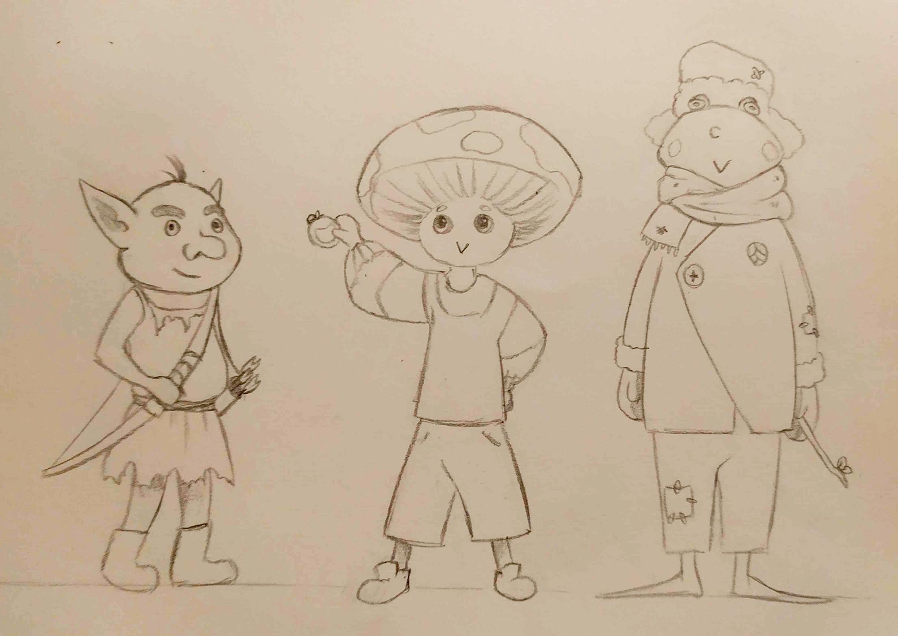
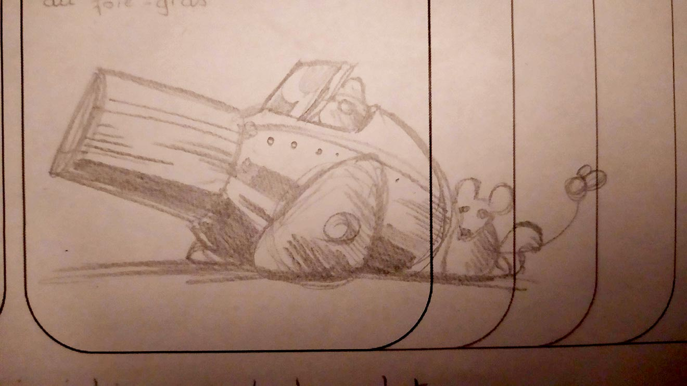
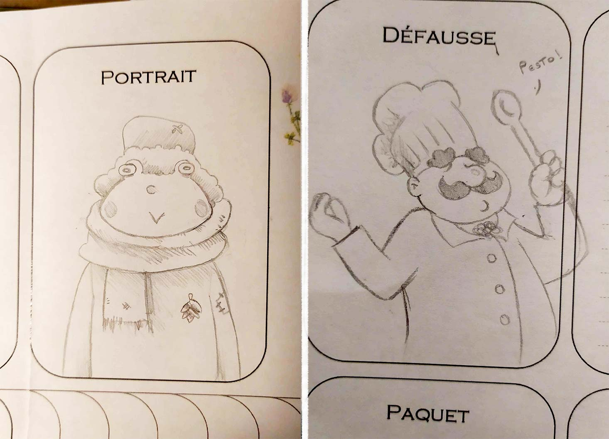

*Note : cet article était initialement prévu comme un retour uniquement destiné à l’auteur du jeu, que j’ai finalement décidé de publier sur mon blog. C’est pourquoi je n’y explique pas en détail les différents concepts du jeu. Je tiens aussi à dire que mes commentaires portent sur une version playtest et inachevée du jeu. Secret of Eons est encore en développement, certaines remarques pourraient donc être caduques d'ici sa sortie officielle.*

*Personnages et leurs invocations dessinés par Fougère*

J’ai récemment terminé une campagne du jeu Secret of Eons de Romaric Briand et Alice Umrani. Le jeu est actuellement en playtest et une campagne démo du jeu est disponible sur le Patreon de Romaric. Dans cet article, je vais donner un retour général sur l’expérience de jeu. Pour donner du contexte, nous étions 5 participants et participantes adultes (dont moi qui étais MJ) et nous avons joué en distanciel via l’application Tabletop Simulator. Ci-dessous, un aperçu du dispositif.

Nous avons terminé la campagne démo en 4 parties d’environ 2h30. Nous avons également joué une 5ème et dernière partie, avec un scénario original de ma part.

## Les plus +
Je vais commencer par les points forts, pour moi, du jeu. Premièrement, l’univers est enchanteur et très prenant. J’aime particulièrement la multitude de peuples qui offre beaucoup de possibilités, c’est quelque chose que les joueurs aussi ont apprécié. L’univers est débridé, on dirait que l’auteur a voulu “tout mettre”, pour notre plus grand plaisir. Pour autant, le jeu reste cohérent. La justification de la grille par les 4 soleils, les descriptions des peuples, les noms et descriptions des différentes régions, les invocations et les larmes… L’ensemble est génial et j’avais l’impression d’être transporté dans un JRPG, mais en jeu de rôle.

Au-delà de l’univers, j’ai adoré le système de jeu basé sur les cartes et le deckbuilding. L’utilisation des différentes couleurs pour représenter des talents et des compétences de combat est très intuitive. Que ce  soit en bagarre ou dans les autres scènes, j’ai été agréablement surpris des stratégies employées par les joueurs pour tirer partie de leur paquet de cartes. Par exemple, certains joueurs, déjà amateurs de jeux de cartes, filtraient leur deck en stockant les couleurs inutilisées, afin de n’avoir plus qu’une ou deux couleurs dans le paquet, diminuant largement le risque d’échec ! Ces techniques me donnaient envie de passer de l’autre côté de l’écran ! J’étais concentré dans mon rôle de MJ, et je n’essayais pas de bien jouer à tout prix, comme c’est conseillé dans la base. Je n’ai donc pas autant profité de l’aspect tactique du jeu que les joueurs.

J’ai également apprécié le système d’expérience que je trouve particulièrement élégant et ludique. Accompagné d’une musique de victoire de RPG, c’est toujours très satisfaisant pour les joueurs de récupérer une nouvelle carte dans leur paquet, et c’est une montée de niveau tellement simple.

Par ailleurs, je trouve pertinent de laisser les joueurs décrire leurs succès et échecs. Je ne crois pas que ce point soit explicité dans la base, mais le jeu s’y prête bien. Lors d’une scène, un personnage-joueur a échoué son action, alors qu’il tentait de couper un cactus. Le joueur en a profité pour raconter que le cactus rentrait dans le sol comme une taupe alors que la lame de son personnage s’apprêtait à le trancher. C’est un super moyen d’ajouter de la consistance et de l’épaisseur au monde via les descriptions des joueurs. 

Le jeu remplit à merveille son objectif, à savoir d’être une introduction simple et ludique au jeu de rôle. L’univers est enchanteur, assez léger, mais quand même chargé de mystère, de quoi attiser la curiosité des joueurs. Les scènes de discussions permettent d’apprivoiser petit à petit le “roleplay”, et pourquoi pas d’apprendre à interpréter son personnage ! Mais Secret of Eons est à la frontière entre jeu de rôle et jeu de société, avec une forte matérialité : des jetons, des dés, des battlemaps, des cartes… beaucoup d’éléments qui seront familiers aux amateurs de jeux de plateau et qui pourront les rassurer, là où des jeux en théâtre de l’esprit pourraient être plus déroutants. 

En ce qui concerne la base, bravo à Alice Umrani pour ses magnifiques illustrations, très évocatrices et qui aident à se plonger dans l’univers. Étant moi-même illustrateur, ça me fait plaisir de voir un jeu si bien illustré à l’heure des IA. Il suffit de montrer les illustrations aux joueurs pour les embarquer dans l’univers. Enfin, bravo à Romaric pour les règles, très claires. J’ai apprécié le chapitre sur la sécurité émotionnelle, court mais très pertinent pour un MJ qui découvrirait le JDR avec ce livre.

## Les moins -

Je vais maintenant aborder certaines réserves que j’ai vis-à-vis du jeu. Premièrement, les combats m’ont posé quelques difficultés. En général, j’aime les jeux narratifs et rapides, avec des enjeux forts et peu d'intervention de la mécanique. Je savais qu’avec SoE, je signais pour un jeu tactique, donc je ne m’attendais pas à des combats expéditifs. Mais j’ai trouvé les combats de la campagne bien trop simples, malgré mes tentatives pour corser la difficulté.

Seuls 2 personnages-joueurs sont tombés épuisés sur la totalité de la campagne (au cours de 2 combats différents). Or, une véritable “défaite” n’intervient que lorsque tout le groupe est épuisé. Une idée séduisante, qui unit le groupe et évite les échecs individuels. Mais avec 4 personnages-joueurs, le groupe avait beaucoup de marge, trop à mon goût. Dans l’immense majorité des combats, je savais par avance que les PJ allaient triompher, et je pense que les joueurs s’en rendaient compte également. La dimension tactique est largement diminuée quand on commence un combat avec la certitude de le gagner, et plusieurs fois, je me disais “à quoi bon ?”. Bien sûr, les combats restaient l’opportunité de narrer comment les PJ triomphaient, à grands coups de descriptions épiques, mais ça n’empêchait pas la lassitude de s’installer.

L’équilibrage des différentes classes s’en trouve compromis. Le guerrier semble plus fort que les autres classes en combat alors que le prêtre semble lui bien plus faible. Le valet de pique permet au guerrier d’enchaîner énormément d’attaques et ses tours sont ainsi bien plus longs, ce qui rend difficile l’équilibrage des temps de parole. D’autre part, le prêtre a naturellement le rôle de soigner ses compagnons. Or, les règles stipulent que les PJ regagnent déjà tous leurs PV à la fin de chaque combat. Cette règle rend le prêtre inefficace. Bien des fois, la joueuse qui incarnait un prêtre s’empressait d’aller au secours de ses compagnons blessés après un combat, avant de se rappeler que c’était inutile, car chaque personnage était déjà soigné après la victoire. Difficile de faire briller le prêtre dans ces conditions…

Bien sûr, le prêtre, ainsi que les autres classes peuvent s’exprimer en dehors des combats, mais le jeu reste très focalisé sur ces derniers. D’autant que la campagne démo en contient énormément ! C’est un enchaînement de combats effréné et j’aurais aimé que la campagne offre plus de place à l’exploration et la discussion. 

Cette régénération automatique des points de vie à la fin de chaque combat pose un autre problème : la gestion des problèmes justement ! Lorsque les PJ s’attaquent à un problème, il n’y a pas d’échec à proprement parler, le problème fonctionne comme une jauge de point de vie. A force de tentatives, le dé du problème descend jusqu’à 0, il est alors résolu. Ce système me laisse perplexe. De la même manière que pour les combats, la tactique est appauvrie - quoi que fassent les joueurs, le problème finira par être résolu, et vient encore une fois ce sentiment de “à quoi bon”. 

En réalité, s'attaquer à un problème n’est pas sans conséquence et provoque de la fatigue chez les PJ, qui se traduit par une perte de PV. Mais cette fatigue est très lente, et les combats si fréquents que cet enjeu semble artificiel. Certes, un PJ risque de perdre quelques PV en s’attaquant à un problème, mais quand bien même, il lui suffit de triompher d’un futur combat pour être régénéré ! Cela se traduit encore une fois par une inefficacité du prêtre, qui se retrouve à soigner par effet de style, et non par réel intérêt tactique. De plus, je crains que cela n’induise un comportement agressif des PJ. Si triompher d’un combat permet de se régénérer, la tactique voudrait qu’on enchaîne les combats ! Mais vu le propos du jeu, est-ce qu’on a pas affaire à un cas de dissonance ludo-narrative ?

Quoi qu’il en soit, la gestion des problèmes ne m’a pas entièrement convaincu et bien souvent, nous nous sommes retrouvés à enchaîner les tirages de cartes, rébarbatifs, sans réel enjeu, jusqu’à ce que le problème soit résolu. Tout comme pour les combats, la résolution des problèmes restait évidemment l’opportunité de narrer les actions des personnages, leur ingéniosité, leur camaraderie ou leurs disputes. Et tout ça était brillant. Mais dans un jeu tactique, la simple couleur des descriptions ne me suffit pas, j’aime sentir qu’il y a un réel enjeu derrière les décisions des joueurs. 

Enfin, c’est un point de détail, mais les joueurs avaient tendance à oublier le fait que tenter de résoudre un problème faisait systématiquement perdre un PV, en cas d’échec, comme de succès. Une règle élégante sur le papier, mais contre-intuitive en pratique et facile à oublier. De plus, une des participantes n’était pas du tout convaincue à l’idée que son personnage magicien perde des PV alors qu’il s’attaquait à un problème grâce à son intellect.

## Quelques remarques supplémentaires
Ni des qualités, ni des défauts, mais des observations que j’ai pu faire au cours de nos parties. Premièrement, l’idée est suggérée à demi-mot dans la base, mais je conseille fortement d’introduire des problèmes au sein des combats. Bien souvent, les joueurs proposent des idées originales pour se sortir de scènes de bagarre. Une négociation, chercher un passage pour s’enfuir, activer un mécanisme… Je posais régulièrement des problèmes sur la table comme “convaincre l’adversaire d’abandonner” ou encore “activer le portail magique”. Des problèmes souvent difficiles, mais faisables, pour accompagner les idées des joueurs. A mon avis, il serait intéressant d’ajouter un passage plus clair dans la base pour préciser que cette option est possible… Encore une fois, il me semble que ça soutiendrait le propos du jeu.

Par ailleurs, les joueurs et moi même étions très emballés pour continuer l’aventure à la fin de la campagne démo. C’est pourquoi j’ai décidé de proposer un dernier scénario, complètement inventé en utilisant les quelques éléments de lore du livre de règles. On ne dispose que de peu d’informations sur l’univers dans le livre 1, mais assez pour mettre l’eau à la bouche, vivement le livre 2 ! 

Pour cette dernière partie, les PJ devaient explorer une ancienne usine d’orichalque et enquêter sur les sombres activités du mystérieux Magicien au regard parsemé d’étoiles… Le scénario était pensé comme un bac à sable, et non comme une succession de scènes comme dans la campagne démo. Plusieurs chemins étaient accessibles dès le départ, et les joueurs étaient libres d’explorer la zone dans l’ordre qu’ils souhaitaient. Dans l’ensemble, l’expérience s’est révélée très positive, et ce format de parties me correspond beaucoup mieux. Je suis donc convaincu que Secret of Eons saura offrir à terme des parties non linéaires et riches en rebondissements, qui surprendront aussi le MJ.

J’ai quand même quelques remarques à faire à ce sujet. D’abord, certains participants, plus débutants, se sont retrouvés en difficulté. Au cours de cette partie, je suis resté assez sobre et efficace dans mes descriptions, et j’attendais des joueurs qu’ils se créent eux-mêmes des opportunités de briller ou d’emmener la narration vers une direction donnée. Je n’avais pas envie de dicter moi-même le rythme. Les participants en question n’avaient pas encore conscience de la liberté dont ils disposaient, probablement mal habitués après une campagne linéaire. A cause de cela, ils sont restés plus passifs que d’habitude. Pour autant, je pense qu’après quelques parties en bac à sable, tout le monde sera capable de profiter de cette agentivité.

En revanche, j’ai constaté une vraie limitation du jeu pour les parties en bac à sable. J’ai beaucoup de parties OSR à mon actif, et dans beaucoup d’entre elles, le groupe de PJ s’est retrouvé séparé. Et ce n’était pas du tout un problème, au contraire, grâce à un système de résolution simple et rapide. Dans Secret of Eons, séparer le groupe est bien plus délicat. En effet, le système de résolution, et surtout le système de combat, sont plus longs et plus complexes. Le combat est un jalon important d’une partie, et il semble difficile d’envisager des combats qui ne réunissent pas tout le groupe. Un combat est un moyen pour le groupe de récupérer des PV, de monter en expérience, de triompher ou de perdre, tous ensemble ! Lors de la dernière partie, j’ai joué avec mes habitudes de MJ OSR, et les PJ se sont naturellement séparés en 2 bandes. Je me suis rapidement rendu compte que cela poserait problème en cas de combat, et nous sommes tombés d’accord au cours du débrief qu’il était préférable dans Secret of Eons de ne pas séparer le groupe,   dans la mesure du possible. Finalement, comme dans un JRPG, la bande est, et doit rester inséparable !

## Hâte de la suite !
Cette découverte de Secret of Eons a été une franche réussite. Le jeu tient ses promesses et toute la table est impatiente à l’idée de lancer une campagne long terme et plus personnelle du jeu, pour découvrir les secrets de l’univers ! En bref, vivement le Livre 2 ! J’espère que Romaric et Alice parviendront à mener à bien ce projet très ambitieux et prometteur. J’ai déjà commencé une nouvelle partie de la campagne démo avec un autre groupe de joueurs, cette fois en présentiel, et ça marche tout autant si ce n’est plus ! 

Je profite de cet article pour partager les dessins réalisés par Fougère au cours de cette campagne, une belle preuve de l’engouement de la table pour le jeu ! J’en profite aussi pour partager les musiques que j’ai utilisées pour nos parties, et qui pourront peut-être vous inspirer, que ce soit pour Secret of Eons, ou un autre jeu dans un univers aux couleurs de JRPG. 

Lien vers la playlist : https://youtube.com/playlist?list=PLCTCaE2D10w4ORoww5Wb0vP0holawzRqU&si=vntJmTCBeXzmu9Fh

